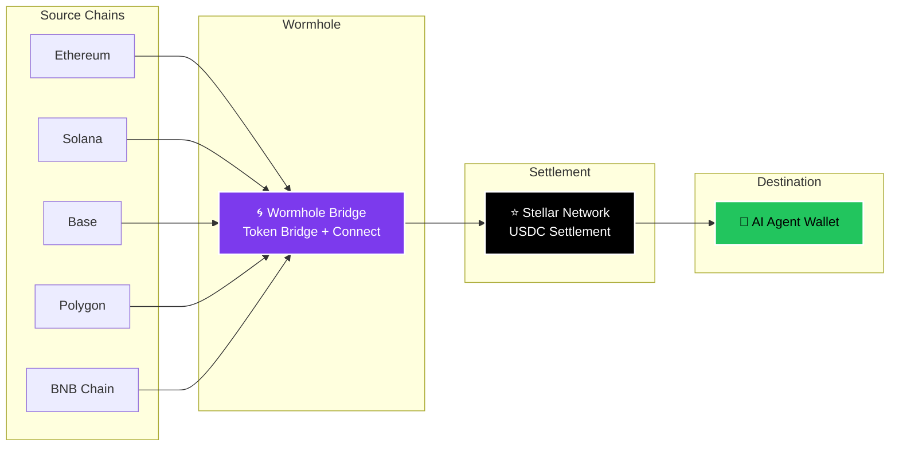
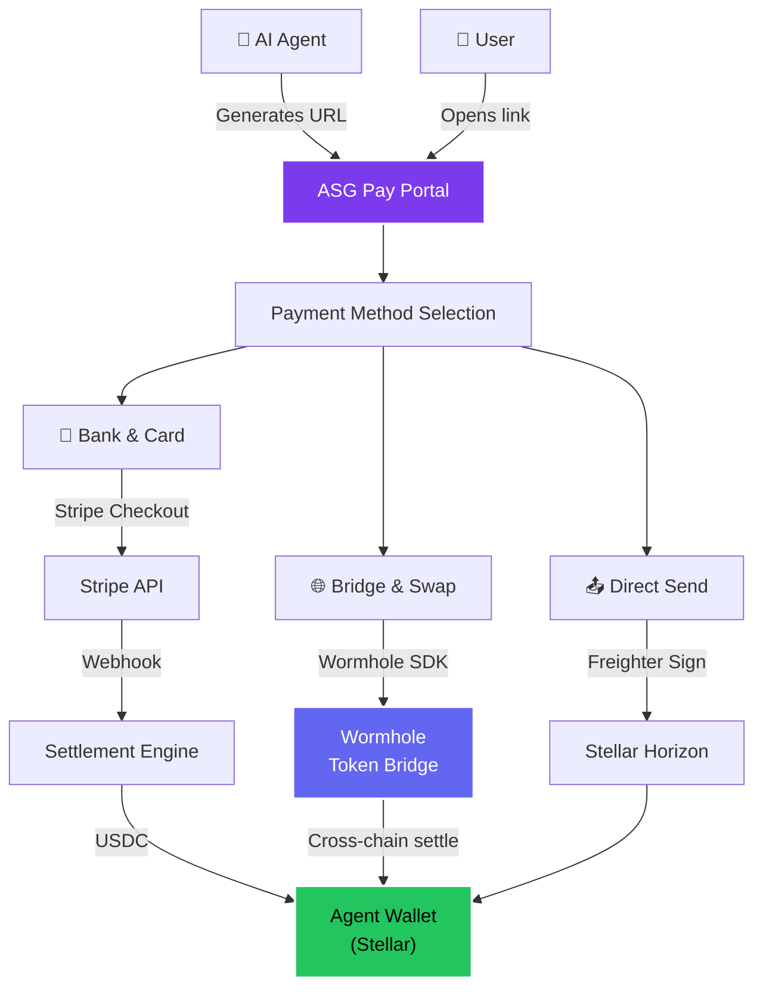

<div align="center">

<picture>
  <source media="(prefers-color-scheme: dark)" srcset="https://raw.githubusercontent.com/ASGCompute/asg-pay-public/main/.github/assets/logo-dark.svg">
  <source media="(prefers-color-scheme: light)" srcset="https://raw.githubusercontent.com/ASGCompute/asg-pay-public/main/.github/assets/logo-light.svg">
  
</picture>

### Cross-Chain Payment Gateway for AI Agents

Fund any AI agent from any chain. One URL. Three payment rails.<br/>
Fiat → Crypto → Bridge — all settling on Stellar.

<br/>

<a href="https://fund.asgcard.dev"></a>
<a href="https://github.com/ASGCompute/asg-pay-public/blob/main/LICENSE"></a>
<a href="https://stellar.org"></a>
<a href="https://wormhole.com"></a>

<br/>

[Live Demo](https://fund.asgcard.dev) ·
[Integration Guide](docs/INTEGRATION_GUIDE.md) ·
[Wormhole Bridge Docs](docs/WORMHOLE_BRIDGE.md) ·
[Stellar Tutorial](docs/STELLAR_TUTORIAL.md) ·
[Contributing](CONTRIBUTING.md)

</div>

<br/>

---

<br/>

## The Problem

AI agents are becoming autonomous economic participants — they purchase APIs, rent compute, pay for storage, and subscribe to SaaS. But funding them is broken:

- **Crypto users** need to know the exact chain, token, and address
- **Fiat users** have no checkout flow at all
- **Cross-chain users** must manually bridge and swap before sending

There is no universal, chain-agnostic way for a human to fund an AI agent.

## The Solution

**ASG Pay** is an open-source checkout page that any AI agent generates with a single URL:

```
https://fund.asgcard.dev/?agentName=MyBot&toAddress=GDQP...&toAmount=50&toToken=USDC
```

The user clicks the link, picks **any** payment method, and the agent's wallet is funded. That's it.

<br/>

<div align="center">

<table>
<tr>
<td align="center"><strong>Built with</strong></td>
<td align="center"><a href="https://stellar.org"></a><br/><sub>Stellar</sub></td>
<td align="center"><a href="https://wormhole.com"></a><br/><sub>Wormhole</sub></td>
<td align="center"><a href="https://stripe.com"></a><br/><sub>Stripe</sub></td>
<td align="center"><a href="https://www.circle.com/usdc"></a><br/><sub>Circle USDC</sub></td>
<td align="center"><a href="https://www.mastercard.com"></a><br/><sub>MasterCard</sub></td>
</tr>
</table>

<table>
<tr>
<td align="center"><strong>Source<br/>chains</strong></td>
<td align="center"><br/><sub>Ethereum</sub></td>
<td align="center"><br/><sub>Solana</sub></td>
<td align="center"><br/><sub>Base</sub></td>
<td align="center"><br/><sub>Polygon</sub></td>
<td align="center"><br/><sub>BNB Chain</sub></td>
<td align="center">→</td>
<td align="center"><br/><sub><strong>Stellar</strong></sub></td>
</tr>
</table>

</div>

<br/>

---

## Three Payment Rails

| Rail | How it Works | Source | Settlement | Status |
|------|-------------|--------|------------|--------|
| 🏦 **Bank & Card** | Stripe Checkout → USDC purchase → Stellar delivery | Fiat (Card / Bank) | Stellar | ✅ Live |
| 🌐 **Bridge & Swap** | Wormhole cross-chain bridge → auto-route → Stellar | Ethereum, Solana, Base, Polygon, BSC | Stellar | ✅ Live |
| 📤 **Direct Send** | Freighter wallet → sign → Horizon submit | Stellar (XLM / USDC) | Stellar | ✅ Live |

All three rails share the same universal URL interface. No matter how the user pays, the agent receives USDC on Stellar.

---

## Wormhole Integration

ASG Pay uses [Wormhole](https://wormhole.com) as its cross-chain interoperability layer, enabling users on **any supported EVM chain** to fund AI agents on Stellar in a single transaction.



### How the Bridge Works

1. **User selects source chain and token** (e.g., USDC on Ethereum)
2. **ASG Pay generates a Wormhole transfer** via the Token Bridge
3. **User signs in their wallet** (MetaMask, Phantom, etc.)
4. **Wormhole bridges the tokens** cross-chain to Stellar
5. **Agent receives USDC** on their Stellar address

### Supported Bridge Paths

| From | Token | To | Bridge |
|------|-------|----|--------|
| Ethereum | USDC, USDT, ETH | Stellar (USDC) | Wormhole Token Bridge |
| Solana | USDC, SOL | Stellar (USDC) | Wormhole Token Bridge |
| Base | USDC, ETH | Stellar (USDC) | Wormhole Token Bridge |
| Polygon | USDC, POL | Stellar (USDC) | Wormhole Token Bridge |
| BNB Chain | USDC, BNB | Stellar (USDC) | Wormhole Token Bridge |

> See [docs/WORMHOLE_BRIDGE.md](docs/WORMHOLE_BRIDGE.md) for detailed integration documentation.

---

## Quick Start

### Use the Hosted Version

```
https://fund.asgcard.dev/?agentName=MyBot&toAddress=GDQP...&toAmount=100&toToken=USDC
```

### Self-Host

```bash
git clone https://github.com/ASGCompute/asg-pay-public.git
cd asg-pay-public
npm install
npm run dev       # → http://localhost:5173
```

### URL Parameters

| Parameter | Required | Default | Description |
|-----------|----------|---------|-------------|
| `agentName` | Recommended | `Stacy agent` | Display name of the AI agent |
| `toAddress` | **Required** | Demo address | Stellar public key (`G...`) |
| `toAmount` | Recommended | `50` | Amount to fund |
| `toToken` | No | `USDC` | Token to receive (`USDC`, `XLM`) |
| `toChain` | No | `Stellar` | Settlement chain |

---

## Architecture



### Tech Stack

| Layer | Technology |
|-------|-----------|
| **Frontend** | React 19, TypeScript, Vite 8 |
| **Styling** | Vanilla CSS (glassmorphic design system, 1700+ lines) |
| **Stellar** | `@stellar/stellar-sdk`, `@stellar/freighter-api` |
| **Cross-chain** | Wormhole Token Bridge, Wormhole Connect |
| **Fiat** | Stripe Checkout |
| **Hosting** | Vercel (auto-deploy from `main`) |

---

## Developer Tools

ASG Pay is part of the broader **ASG Card** ecosystem — a suite of open-source tools for AI agent payments:

| Package | Description | Install |
|---------|-------------|---------|
| **ASG Pay** | Cross-chain funding portal (this repo) | `git clone` / [hosted](https://fund.asgcard.dev) |
| **[@asgcard/sdk](https://npmjs.com/package/@asgcard/sdk)** | TypeScript SDK for payment integration | `npm i @asgcard/sdk` |
| **[@asgcard/cli](https://npmjs.com/package/@asgcard/cli)** | CLI for wallet setup + card management | `npx @asgcard/cli` |
| **[@asgcard/mcp-server](https://npmjs.com/package/@asgcard/mcp-server)** | MCP Server (11 tools) for AI agents | `npx @asgcard/mcp-server` |

### Integration Examples

<details>
<summary><strong>Python — Generate payment link</strong></summary>

```python
from urllib.parse import urlencode

def create_funding_url(agent_name: str, address: str, amount: float) -> str:
    params = {
        "agentName": agent_name,
        "toAddress": address,
        "toAmount": str(amount),
        "toToken": "USDC",
    }
    return f"https://fund.asgcard.dev/?{urlencode(params)}"

# Usage
url = create_funding_url("Trading Bot", "GDQP2KPQ...", 100)
print(f"Fund your agent: {url}")
```

</details>

<details>
<summary><strong>TypeScript — Generate payment link</strong></summary>

```typescript
function createFundingUrl(params: {
  agentName: string;
  toAddress: string;
  toAmount: number;
  toToken?: string;
}): string {
  const search = new URLSearchParams({
    agentName: params.agentName,
    toAddress: params.toAddress,
    toAmount: String(params.toAmount),
    toToken: params.toToken || "USDC",
  });
  return `https://fund.asgcard.dev/?${search.toString()}`;
}
```

</details>

<details>
<summary><strong>MCP Tool — Auto-generate via AI agent</strong></summary>

```bash
# Install the MCP server
npx @asgcard/mcp-server

# The MCP server provides payment URL generation as a built-in tool
# AI agents using Claude, Cursor, or Codex can create funding links automatically
```

</details>

<details>
<summary><strong>Stellar — Monitor incoming payments</strong></summary>

```typescript
import { Horizon } from "@stellar/stellar-sdk";

const server = new Horizon.Server("https://horizon.stellar.org");

server.payments()
  .forAccount("YOUR_AGENT_ADDRESS")
  .cursor("now")
  .stream({
    onmessage: (payment) => {
      if (payment.type === "payment") {
        console.log(`Received ${payment.amount} ${payment.asset_code || "XLM"}`);
      }
    },
  });
```

</details>

---

## Project Structure

```
src/
├── App.tsx                    # Root: URL params, balance fetching, routing
├── types.ts                   # TypeScript interfaces (AppState, TokenInfo)
├── index.css                  # Design system (1700+ lines, CSS variables)
├── providers.tsx              # React context providers
├── components/
│   ├── AgentInfoCard.tsx      # Left panel: agent identity, destination, balances
│   ├── PaymentSelection.tsx   # Payment method selection (Fiat / Stablecoin / Crypto)
│   ├── ExchangeWidget.tsx     # Tabbed widget: Bank & Card / Bridge & Swap / Send
│   ├── ReceiveWidget.tsx      # Route selection and bridge confirmation
│   ├── Header.tsx             # Page header with wallet status
│   ├── ErrorBoundary.tsx      # React error boundary
│   └── modals/
│       ├── TokenModal.tsx     # Multi-chain token selector
│       ├── SettingsModal.tsx   # Bridge settings (slippage, gas, routes)
│       ├── WalletModal.tsx    # Wallet connection (Freighter, MetaMask, Phantom, WC)
│       └── ProgressOverlay.tsx # Tx progress + Wormhole bridge tracking + success state
└── utils/
    └── stellar.ts             # Stellar SDK: build, sign, submit transactions
```

---

## Wallet Support

| Wallet | Chains | Protocol |
|--------|--------|----------|
| **Freighter** | Stellar | Native (TESTNET + MAINNET) |
| **MetaMask** | Ethereum, Base, Polygon, BSC | EVM + Wormhole Bridge |
| **Phantom** | Solana | Solana + Wormhole Bridge |
| **WalletConnect** | Multi-chain | QR Code |

---

## Security

- 🔒 **Destination locked** — recipient address is pre-filled and immutable
- 🔑 **No private keys** — all signing happens in the user's wallet extension
- 🌐 **Client-side only** — no backend stores sensitive data
- ✅ **Open source** — fully auditable codebase
- 🛡️ **CSP headers** — Content Security Policy enforced via Vercel

---

## Roadmap

| Phase | Status | Description |
|-------|--------|-------------|
| ✅ Phase 1 | **Complete** | Core UI: agent card, payment selection, glassmorphic design system |
| ✅ Phase 2 | **Complete** | Stellar wallet: Freighter integration, real tx signing, Horizon submission |
| ✅ Phase 3 | **Complete** | Fiat on-ramp: Stripe Checkout with fee calculation |
| ✅ Phase 4 | **Complete** | Cross-chain bridge: Wormhole Token Bridge integration |
| 🔧 Phase 5 | **In Progress** | Wormhole Connect widget embedding + advanced route optimization |
| 📋 Phase 6 | **Planned** | Payment API: programmatic checkout sessions + webhook callbacks |
| 📋 Phase 7 | **Planned** | Soroban: on-chain payment verification smart contract |

---

## Contributing

We welcome contributions from the Stellar and Wormhole communities. See [CONTRIBUTING.md](CONTRIBUTING.md) for guidelines.

### Good First Issues

- Add Wormhole Connect widget to Bridge & Swap tab
- Implement bridge transaction status polling via Wormhole API
- Add loading skeletons while Horizon balance data loads
- Keyboard accessibility for modal overlays

---

## Ecosystem & Collaboration

<table>
  <tr>
    <td align="center" width="20%">
      <br/>
      <strong>Stellar</strong><br/>
      <sub>Settlement network</sub>
    </td>
    <td align="center" width="20%">
      <br/>
      <strong>Wormhole</strong><br/>
      <sub>Cross-chain bridge</sub>
    </td>
    <td align="center" width="20%">
      <br/>
      <strong>Stripe</strong><br/>
      <sub>Fiat on-ramp</sub>
    </td>
    <td align="center" width="20%">
      <br/>
      <strong>Circle</strong><br/>
      <sub>USDC issuer</sub>
    </td>
    <td align="center" width="20%">
      <br/>
      <strong>MasterCard</strong><br/>
      <sub>Card issuance (via ASG Card)</sub>
    </td>
  </tr>
</table>

---

## License

[Apache 2.0](LICENSE) — Use it, fork it, build on it.

<br/>

<div align="center">
  <sub>Built with ♥ by <a href="https://asgcard.dev">ASG Compute</a> for the Stellar and Wormhole ecosystems.</sub>
</div>
