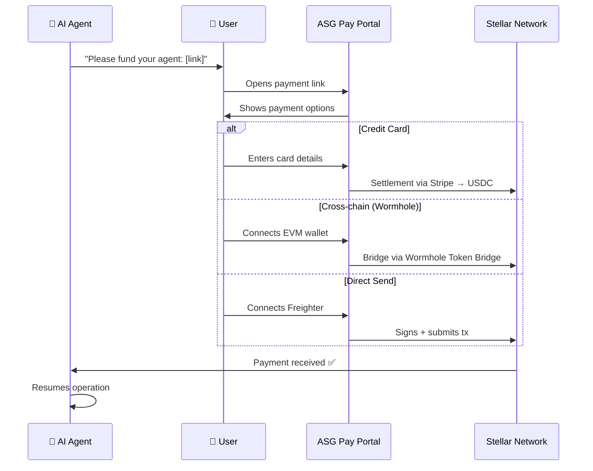

# Building Payment-Enabled AI Agents on Stellar

> A tutorial for building AI agents that accept cross-chain payments via ASG Pay and the Stellar network.

## Overview

This tutorial shows you how to add payment capabilities to your AI agent. By the end, your agent will:

1. Generate a payment URL for any user
2. Accept payments via credit card, crypto bridge (Wormhole), or direct Stellar transfer
3. Monitor when funds arrive on-chain

**Time required:** ~15 minutes

## Prerequisites

- A Stellar keypair (your agent's wallet)
- Node.js 18+ (or Python 3.8+)

## Step 1: Create Your Agent's Stellar Wallet

```bash
npm install @stellar/stellar-sdk
```

```typescript
import { Keypair } from "@stellar/stellar-sdk";

const agentKeypair = Keypair.random();
console.log("Public Key:", agentKeypair.publicKey());
console.log("Secret Key:", agentKeypair.secret());
// ⚠️ Store the secret key securely!
```

For testnet, fund it with friendbot:
```bash
curl "https://friendbot.stellar.org/?addr=YOUR_PUBLIC_KEY"
```

## Step 2: Generate Payment URLs

Your agent generates payment links that open ASG Pay:

```typescript
function createPaymentLink(amount: number): string {
  const params = new URLSearchParams({
    agentName: "My Trading Bot",
    toAddress: "GDQP2KPQGKIAEFHQ3XNKFYJVXVSHRQEB37AIR6T3JZWNM7YSHWM",
    toAmount: String(amount),
    toToken: "USDC",
  });
  return `https://fund.asgcard.dev/?${params.toString()}`;
}

const link = createPaymentLink(50);
console.log(`Please fund your agent here: ${link}`);
```

Users who receive this link can fund the agent from **any chain** via Wormhole, from **fiat** via Stripe, or **directly** via Stellar.

## Step 3: Monitor Incoming Payments

```typescript
import { Horizon } from "@stellar/stellar-sdk";

const server = new Horizon.Server("https://horizon.stellar.org");
const agentAddress = "YOUR_AGENT_PUBLIC_KEY";

server.payments()
  .forAccount(agentAddress)
  .cursor("now")
  .stream({
    onmessage: (payment) => {
      if (payment.type === "payment" && payment.to === agentAddress) {
        console.log(`Received ${payment.amount} ${payment.asset_code || "XLM"}`);
        console.log(`From: ${payment.from}`);
        // Trigger your agent's action here
      }
    },
  });
```

## Step 4: Freighter Integration (Advanced)

For agents with a web interface — direct Stellar payment signing:

```typescript
import { isConnected, requestAccess, signTransaction } from "@stellar/freighter-api";
import { TransactionBuilder, Networks, Operation, Asset } from "@stellar/stellar-sdk";

async function sendPayment(destination: string, amount: string) {
  const connected = await isConnected();
  if (!connected) throw new Error("Freighter not installed");

  const access = await requestAccess();
  const server = new Horizon.Server("https://horizon.stellar.org");
  const account = await server.loadAccount(access.address);

  const tx = new TransactionBuilder(account, {
    fee: "100",
    networkPassphrase: Networks.PUBLIC,
  })
    .addOperation(Operation.payment({ destination, asset: Asset.native(), amount }))
    .setTimeout(300)
    .build();

  const signedXdr = await signTransaction(tx.toXDR(), {
    networkPassphrase: Networks.PUBLIC,
  });

  const result = await server.submitTransaction(
    TransactionBuilder.fromXDR(signedXdr, Networks.PUBLIC)
  );

  return result.hash;
}
```

## Step 5: Fork & Customize ASG Pay

```bash
git clone https://github.com/ASGCompute/asg-pay-public.git
cd asg-pay-public
npm install
npm run dev    # Preview locally
npm run build  # Build for production
```

Deploy `dist/` to Vercel, Netlify, or any static hosting.

## Architecture



## Resources

- **ASG Pay Portal**: [fund.asgcard.dev](https://fund.asgcard.dev)
- **Wormhole Docs**: [docs.wormhole.com](https://docs.wormhole.com)
- **Stellar SDK**: [stellar.github.io/js-stellar-sdk](https://stellar.github.io/js-stellar-sdk/)
- **Freighter API**: [docs.freighter.app](https://docs.freighter.app)
- **Horizon API**: [developers.stellar.org/docs/data/horizon](https://developers.stellar.org/docs/data/horizon)

---

*Built with ♥ by ASG Compute for the Stellar and Wormhole ecosystems.*
