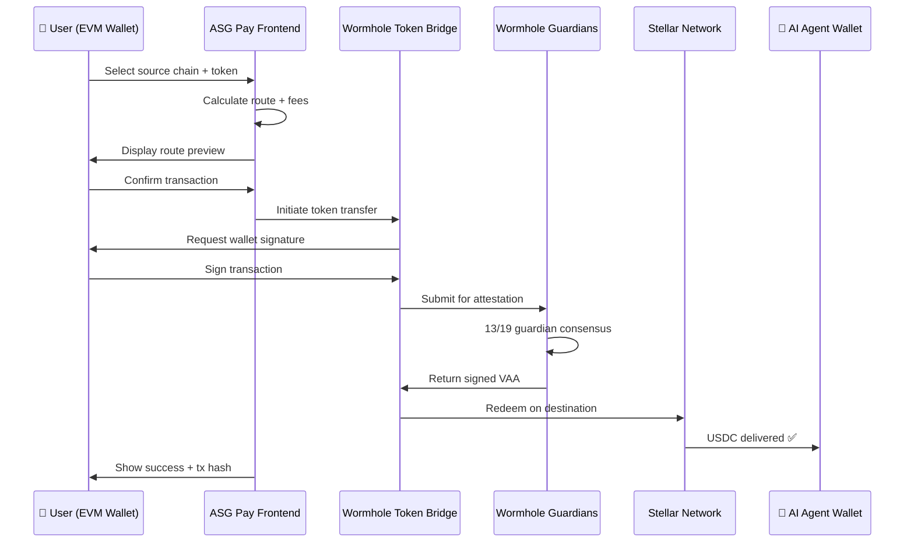

# Wormhole Cross-Chain Bridge — ASG Pay Integration

> Technical documentation for the Wormhole Token Bridge integration in ASG Pay.

## Overview

ASG Pay integrates the [Wormhole](https://wormhole.com) interoperability protocol to enable cross-chain payments from any supported EVM chain to Stellar. This allows users on Ethereum, Solana, Base, Polygon, and BNB Chain to fund AI agents with a single transaction.

## Architecture



## Token Bridge Flow

### 1. Source Chain Lock

When a user initiates a cross-chain payment, their tokens are locked in the Wormhole Token Bridge contract on the source chain:

```typescript
// Simplified Wormhole transfer initiation
import { getTokenBridgeForChain } from "@wormhole-foundation/sdk";

const transfer = await tokenBridge.transfer(
  sourceChain,     // e.g., "Ethereum"
  sourceToken,     // e.g., USDC contract address
  amount,          // Transfer amount
  "Stellar",       // Destination chain
  agentAddress     // Stellar public key (G...)
);
```

### 2. Guardian Attestation

The Wormhole Guardian network (19 validators) observes the lock transaction and produces a **Verified Action Approval (VAA)** — a signed attestation that the tokens were locked on the source chain.

- **Consensus requirement:** 13 of 19 Guardians must sign
- **Typical latency:** 15-60 seconds depending on source chain finality

### 3. Destination Redemption

The signed VAA is submitted to the Stellar network to mint wrapped tokens or release native USDC to the agent's wallet.

## Supported Routes

| Source Chain | Tokens | Estimated Time | Typical Fee |
|-------------|--------|----------------|-------------|
| Ethereum | USDC, USDT, ETH, WETH | ~15 minutes | ~$5-15 |
| Solana | USDC, SOL | ~15 seconds | ~$0.01 |
| Base | USDC, ETH | ~5 minutes | ~$0.50 |
| Polygon | USDC, POL | ~5 minutes | ~$0.10 |
| BNB Chain | USDC, BNB | ~5 minutes | ~$0.50 |

> Times are approximate and depend on source chain finality and network congestion.

## Route Optimization

ASG Pay implements intelligent route selection:

1. **Cheapest first** — sorts available routes by total cost (gas + bridge fee)
2. **Speed preference** — option to prioritize faster routes
3. **Slippage protection** — configurable max slippage (default: auto)
4. **Bridge selection** — uses Wormhole as primary bridge with fallback options

### Settings

| Setting | Default | Options |
|---------|---------|---------|
| Route priority | Best Return | Best Return, Fastest |
| Gas price | Normal | Slow, Normal, Fast |
| Max slippage | Auto | Auto, 0.5%, 1%, 3% |
| Bridge | Wormhole | Wormhole (primary) |

## Frontend Integration

The bridge flow is implemented in the `ExchangeWidget` component and tracked via the `ProgressOverlay`:

```
src/components/
├── ExchangeWidget.tsx        # Bridge & Swap tab UI
├── ReceiveWidget.tsx          # Route display + confirmation
└── modals/
    ├── TokenModal.tsx         # Multi-chain token selector
    ├── SettingsModal.tsx      # Bridge configuration
    └── ProgressOverlay.tsx    # Wormhole bridge progress tracking
```

### Transaction Progress States

```
1. [✅] Wallet confirmed       — User connected + signed
2. [⏳] Broadcasting tx        — Source chain transaction submitted
3. [⏳] Bridging via Wormhole  — Guardian attestation in progress
4. [⏳] Delivering to agent    — Stellar redemption
5. [✅] Complete               — Success + tx hash displayed
```

## Error Handling

| Error | Cause | Recovery |
|-------|-------|----------|
| `INSUFFICIENT_FUNDS` | User doesn't have enough tokens | Show balance, suggest lower amount |
| `BRIDGE_TIMEOUT` | Guardian attestation took >5 min | Retry redemption with VAA |
| `REDEMPTION_FAILED` | Stellar-side redemption error | Auto-retry with exponential backoff |
| `USER_REJECTED` | User rejected wallet signature | Reset to bridge confirmation |

## Security Considerations

- **No custodial risk** — ASG Pay never holds user funds; all transfers are wallet-to-bridge-to-wallet
- **Wormhole Guardian security** — 19 institutional validators with distributed key management
- **Destination locking** — Agent address is pre-filled and cannot be changed by the user
- **Slippage protection** — Maximum slippage enforced to prevent sandwich attacks

## Further Reading

- [Wormhole Documentation](https://docs.wormhole.com)
- [Wormhole Token Bridge](https://docs.wormhole.com/wormhole/explore-wormhole/token-bridge)
- [Wormhole Connect](https://docs.wormhole.com/wormhole/wormhole-connect/overview)
- [Stellar Horizon API](https://developers.stellar.org/docs/data/horizon)
- [ASG Pay Integration Guide](INTEGRATION_GUIDE.md)
